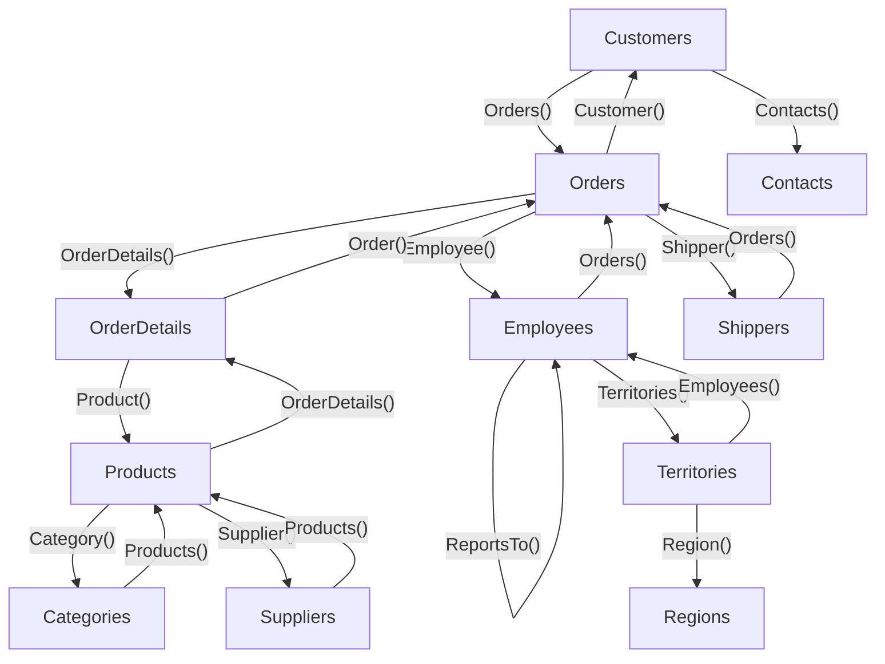

```mermaid
graph TD

    %% Customer Entity Relationships
    Customers --> |"Orders()"| Orders
    Customers --> |"Contacts()"| Contacts

    %% Orders Relationships
    Orders --> |"OrderDetails()"| OrderDetails
    Orders --> |"Customer()"| Customers
    Orders --> |"Employee()"| Employees
    Orders --> |"Shipper()"| Shippers

    %% OrderDetail Relationships
    OrderDetails --> |"Order()"| Orders
    OrderDetails --> |"Product()"| Products

    %% Product Entity Relationships
    Products --> |"OrderDetails()"| OrderDetails
    Products --> |"Category()"| Categories
    Products --> |"Supplier()"| Suppliers

    %% Category Relationships
    Categories --> |"Products()"| Products

    %% Supplier Relationships
    Suppliers --> |"Products()"| Products

    %% Employee Relationships
    Employees --> |"Orders()"| Orders
    Employees --> |"ReportsTo()"| Employees
    Employees --> |"Territories()"| Territories

    %% Shipper Relationships
    Shippers --> |"Orders()"| Orders

    %% Territory Relationships
    Territories --> |"Region()"| Regions
    Territories --> |"Employees()"| Employees
```
